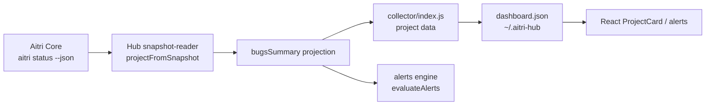

# System Design — hub-bug-summary-snapshot

## Executive Summary

This feature is a Node.js ESM projection fix inside the existing Aitri Hub collector. No new runtime dependencies, services, endpoints, storage files, or UI surfaces are introduced.

The implementation updates `lib/collector/snapshot-reader.js` so `projectFromSnapshot(snapshot)` maps Aitri Core's current `snapshot.bugs` aggregate into a Hub-compatible `bugsSummary`:

- `total`: historical registered bug count from `bugs.total`
- `open`: active open bug count from `bugs.open`
- `resolved`: derived as `Math.max(total - open, 0)`
- `blocking`: active blocking count from `bugs.blocking`
- `bySeverityActive`: active severity buckets from `bugs.bySeverity`
- `critical`, `high`, `medium`, `low`: compatibility aliases for active severity buckets
- `openIds`: active bug IDs from `bugs.openIds`

Legacy `BUGS.json` fallback remains in `lib/collector/bugs-reader.js` and is not changed.

## System Architecture



Components:

- `lib/collector/snapshot-reader.js`: owns snapshot-to-Hub projection. This feature changes only `projectBugsSummary(bugs)` and related unit coverage.
- `lib/collector/index.js`: consumes projected `bugsSummary` as it does today. No scheduling or fallback behavior changes.
- `lib/alerts/engine.js`: continues to evaluate active bug alerts using `bugsSummary.open` and active severity fields.
- `lib/collector/bugs-reader.js`: legacy direct file reader. No change.
- `~/.aitri-hub/dashboard.json`: receives the projected object. No new file or schema version is introduced.

Traceability:

- FR-001: `projectBugsSummary` maps current Aitri fields.
- FR-002: `projectBugsSummary` derives `resolved`.
- FR-003: compatibility aliases preserve active severity checks.
- FR-004: projection does not fabricate `fixed`, `verified`, or `closed` from snapshot.
- FR-005: `bugs-reader.js` remains unchanged.

## Data Model

Snapshot input from Aitri Core:

```ts
type AitriSnapshotBugs = {
  total?: number;
  open?: number;
  blocking?: number;
  bySeverity?: {
    critical?: number;
    high?: number;
    medium?: number;
    low?: number;
  };
  openIds?: string[];
};
```

Hub projected model:

```ts
type HubSnapshotBugsSummary = {
  total: number;
  open: number;
  resolved: number;
  blocking: number;
  bySeverityActive: {
    critical: number;
    high: number;
    medium: number;
    low: number;
  };
  critical: number;
  high: number;
  medium: number;
  low: number;
  openIds: string[];
};
```

Field constraints:

- Counts must be non-negative integers.
- Invalid or missing count fields become `0`.
- `resolved = Math.max(total - open, 0)`.
- `bySeverityActive` represents active/open severity only.
- `critical`, `high`, `medium`, and `low` are compatibility aliases for `bySeverityActive`.
- `openIds` preserves string IDs only; missing or non-array values become `[]`.
- Snapshot-derived projection does not infer `fixed`, `verified`, or `closed`.

Legacy model:

`readBugsSummary(projectDir, artifactsDir)` continues to return its existing direct `BUGS.json` shape with `open`, `fixed`, `verified`, `closed`, active severities, and `openIds`.

## API Design

No HTTP API changes.

Internal module API:

```ts
// Existing export, unchanged.
export function projectFromSnapshot(snapshot: object): {
  bugsSummary: HubSnapshotBugsSummary | null;
  // other existing projected fields unchanged
}
```

Internal helper behavior:

```ts
function projectBugsSummary(bugs: unknown): HubSnapshotBugsSummary | null
```

Rules:

- Return `null` when `bugs` is missing or not an object.
- Use only aggregate fields already present in `bugs`.
- Do not read files, execute commands, or call network APIs.
- Preserve current alert compatibility by setting both `bySeverityActive.high` and `high`.

Error behavior:

- Missing `bySeverity` does not throw; active severity buckets default to zero.
- Missing `openIds` does not throw; `openIds` defaults to `[]`.
- Invalid count values do not throw; invalid counts become zero.

## Security Design

Trust boundary:

- `snapshot.bugs` is data produced by the local `aitri status --json` process and is already loaded by the collector.
- The projection treats every field as untrusted shape data and validates type before use.

Security controls:

- No new filesystem reads.
- No new writes.
- No new command execution.
- No new network calls.
- No new HTTP endpoints.
- No user input parsing.
- `openIds` includes only string values to avoid propagating objects into UI rendering.

This feature does not alter authentication, localhost-only API guards, or dashboard serving behavior.

## Performance & Scalability

The projection is O(1) with respect to historical bug count because it reads aggregate fields only.

Performance design:

- No iteration over bug records.
- No JSON parsing added beyond existing snapshot parsing.
- No caching needed because projection is constant-time and runs once per project per collector cycle.

NFR-002 is satisfied by unit testing projection in a loop. Expected runtime is far below 1ms per projection on local Node.js 18+ because the function performs only integer checks, object property reads, and one array filter/map over `openIds`.

## Deployment Architecture

No deployment architecture changes.

Runtime:

- Existing Node.js ESM collector.
- Existing React dashboard.
- Existing local `~/.aitri-hub/dashboard.json` file.

CI/CD:

- Use existing `node:test` test suite.
- Add or update unit tests in `tests/unit/snapshot-reader.test.js`.
- Run targeted tests for snapshot projection and alert compatibility.

No Dockerfile, server, port, environment variable, or deployment target changes are required.

## Risk Analysis

ADR-01: Snapshot bug projection strategy

Context: Hub must adapt to Aitri Core's current bug aggregate shape without changing Core.

Option A: Update Hub projection to current snapshot shape and add compatibility aliases.

- Pros: zero Aitri Core cost; preserves active alert behavior; exposes total/open/resolved accurately.
- Cons: snapshot-derived and legacy `BUGS.json` summaries have related but not identical fields.

Option B: Require Aitri Core to emit `fixed`, `verified`, and `closed`.

- Pros: one richer canonical shape.
- Cons: violates feature scope; requires Core change; implies historical status semantics Core intentionally does not expose.

Decision: Option A.

Consequences: Hub shows accurate registered/open/resolved counts from snapshot and avoids promising unavailable historical breakdowns.

ADR-02: Backward compatibility for active severity consumers

Context: Existing alert code checks `bugsSummary.critical`, `high`, `medium`, and `low`.

Option A: Keep top-level severity aliases in addition to `bySeverityActive`.

- Pros: minimal blast radius; existing alerts continue working; tests can focus on projection.
- Cons: duplicates severity data in two places.

Option B: Change all consumers to use `bySeverityActive`.

- Pros: cleaner model long term.
- Cons: wider change; higher regression risk; not required for this feature.

Decision: Option A.

Consequences: New model is explicit while old consumers remain compatible.

ADR-03: Legacy reader handling

Context: Direct `BUGS.json` fallback already returns `fixed`, `verified`, and `closed`.

Option A: Leave `readBugsSummary` unchanged.

- Pros: preserves fallback behavior; satisfies FR-005; smallest change.
- Cons: snapshot and legacy summaries are not identical.

Option B: Normalize legacy reader to the new snapshot summary.

- Pros: one Hub model.
- Cons: changes legacy semantics; could break tests and UI assumptions; outside scope.

Decision: Option A.

Consequences: Snapshot and legacy paths remain semantically distinct but compatible for active bug alerting.

ADR-04: State management and deployment target

Context: This feature changes collected data, not UI state or infrastructure.

Option A: Keep existing dashboard JSON state and local deployment.

- Pros: no new persistence; no new server behavior; aligns with no-go zone.
- Cons: UI will only show new fields where existing surfaces consume them or future UI uses them.

Option B: Add a new UI state store or dashboard schema version.

- Pros: stronger explicit schema migration path.
- Cons: unnecessary for additive fields; increases scope.

Decision: Option A.

Consequences: The change is additive and deploys with existing Hub runtime.

Failure blast radius:

Component: Aitri Core snapshot bugs object

- Blast radius: If missing or malformed, snapshot bug summary becomes null or zero/defaults.
- User impact: Project may show no bug summary rather than crashing.
- Recovery: Next collector cycle with valid snapshot restores summary.

Component: `projectBugsSummary` projection

- Blast radius: Incorrect mapping can affect bug counts and open-bug alerts for snapshot-derived projects.
- User impact: Dashboard may under-report bug history or active severity.
- Recovery: Unit tests cover representative shapes; rollback is limited to one helper.

Component: Legacy `BUGS.json` reader

- Blast radius: Not modified by this feature.
- User impact: Fallback projects keep previous behavior.
- Recovery: Existing tests remain in place.

Top risks:

- Risk: Two related bug summary shapes can confuse future developers.
  Mitigation: Name snapshot severity bucket `bySeverityActive` and test compatibility aliases.

- Risk: UI does not yet render total/resolved count visibly.
  Mitigation: This feature guarantees data availability in `dashboard.json`; new UI display is out of scope unless separately requested.

- Risk: Active severity interpretation could be mistaken as historical severity.
  Mitigation: Field name and tests use `bySeverityActive`.

## Technical Risk Flags

[RISK] Snapshot and legacy bug summaries have different semantics

Conflict: FR-001 requires snapshot-derived `total/open/resolved`, while FR-005 preserves legacy `fixed/verified/closed` behavior.

Mitigation: Keep active alert compatibility fields (`open`, `critical`, `high`, `medium`, `low`, `openIds`) common across both paths; document `bySeverityActive` as active-only.

Severity: medium

[RISK] Data available before UI display

Conflict: The user-visible need is to distinguish no bugs from historical bugs, but the feature scope says no new bug-management UI.

Mitigation: This feature makes the distinction available in `dashboard.json`; a future UI-only feature can render `total/open/resolved` if desired.

Severity: low
